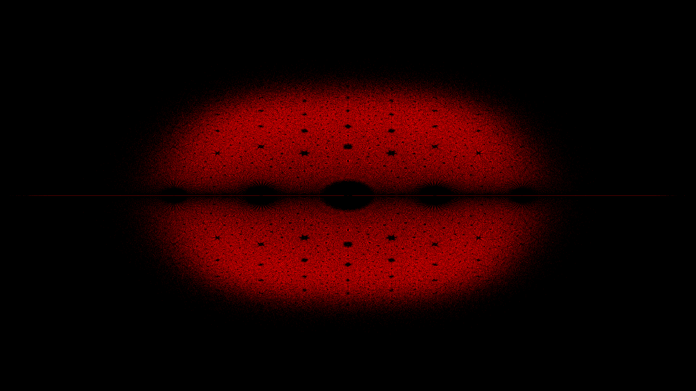

# Bohemian engine

A simple header only library to compute **Bohemian** matrices and their eigenvalues for visualization. A family of [Bohemian matrices](http://www.bohemianmatrices.com/) is a distribution of random matrices where the matrix entries are sampled from a discrete set of bounded height integers. The discrete set is independent of the dimension of the matrices. Bohemian eigenvalues are simply the eigenvalues of such matrices.

Details about the implementation can be found [here](https://balavk.net/posts/computing-bhime-eigenvalues/)

## Simple example

In this example we compute 4 million `5 x 5` Bohemian matrices whose entries are sampled randomly from the set `(-1, 0, 1)`

```c++
#include <iostream>

#include "bhime.hpp"

auto const N = 5;
constexpr auto NX = 2 * 1920;
constexpr auto NY = 2 * 1080;

int main(int argc, char **argv) {
  // 2D density map
  Histogram2d<NX, NY> eigenvalue_density(-4, 4, -4, 4);
  BHMatrixGenerator<N, 4000000, -1, 0, 1> generator;
  std::for_each(generator.begin(), generator.end(), [&](const auto &matrix) {
    if (!matrix.is_singular()) {
      auto eigenvalues = matrix.eigenvalues();
      for (auto i = 0; i < N; i++) {
        eigenvalue_density.update(eigenvalues[i].real(), eigenvalues[i].imag());
      }
    }
  });

  // Save density map as image
  eigenvalue_density.to_png("test.png");

  return 0;
}
```

The resulting distribution of eigenvalues on the complex plane is the following


